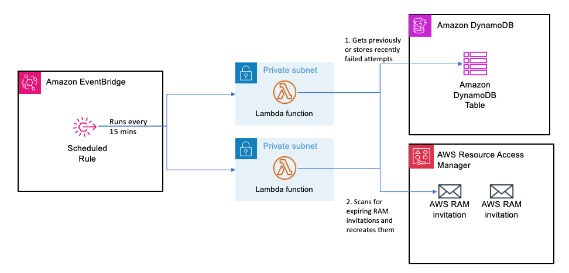

# lf-monitor-for-expired-ram-invites

## Purpose

This utility will monitor for nearing RAM invites for expiration and will recreate them. This will prevent the user from having to manually re-recreate the invites until the recipeint accepts the invite. 

## Solution overview

The solution provides an AWS Cloud Formation template that creates an AWS Lambda function, related IAM roles for the Lambda, and EventBridge Rule that is scheduled for every 15 mins. When the Lambda gets kicked off, it will look for ASSOCIATING RAM shares and determines whether it should recreate the RAM invitation. This is done by disassociating the principal with the RAM share and reassociating the principal.



## Prerequisites

* AWS account where you want RAM invitations to be monitored.
* Permissions in the account to launch the Cloud Formation template that creates the required Lambda role, and DynamoDB tables.
* AWS CLI configured with necessary permissions.
* Python 3.12 or later.
* Since the Lambdas will be calling AWS services, network connectivity is required between the Lambda the AWS services, for example, using a NAT Gateway. See https://docs.aws.amazon.com/lambda/latest/dg/configuration-vpc-internet.html for more details.

To run/build this project, [Poetry](https://python-poetry.org/docs/) needs to be installed.

In addition, to run the quality checks, the following tools are also required:

* [sam](https://github.com/aws/aws-sam-cli)
* [cfn-lint](https://github.com/aws-cloudformation/cfn-lint)
* [cfn_nag](https://github.com/stelligent/cfn_nag)
* [checkov](https://github.com/bridgecrewio/checkov)
* [isort](https://github.com/PyCQA/isort) (installed automatically in the virtual environment)
* [pylint](https://github.com/pylint-dev/pylint) (installed automatically in the virtual environment)
* [black](https://github.com/psf/black) (installed automatically in the virtual environment)
* [bandit](https://github.com/PyCQA/bandit) (installed automatically in the virtual environment)

## Running locally

```bash
AWS_ACCOUNT_ID=$(aws sts get-caller-identity --query 'Account' --output text)
cat events/check_ram_invites.json | sed -e "s/AWS_ACCOUNT_ID/${AWS_ACCOUNT_ID}/" | sam local invoke --event - "MonitorForExpiredRAMInvitesFunction"
```

## Deploying

This solution can be easily deployed using SAM (fill out the paramaters):

```bash
sam build
sam deploy --capabilities CAPABILITY_IAM --parameter-overrides ParameterKey=VpcId,ParameterValue=<vpc-xxxx> ParameterKey=SubnetId1,ParameterValue=<subnet-yyyy> ParameterKey=SubnetId2,ParameterValue=<subnet-zzzz> ParameterKey=SubnetId3,ParameterValue=<subnet-zzzz> ParameterKey=DryRun,ParameterValue=<false>
```

CloudFormation Template Parameters
| Parameter | Description | Default Value | Acceptable Values |
| --------- | ----------- | ------------- | ----------------- |
| LambdaArchitecture | Lambda architecture (x86_64 or arm64) | arm64 | arm64 or amd64 |
| LambdaMemorySize | Memory Size of Lambda | 128 | Must be between 128 and 3008 |
| LambdaTimeout | Timeout of Lambda in seconds | 300 (seconds) | Must be between 1 and 900 seconds|
| LambdaMemorySize | Memory Size of Lambda | 128 | Must be between 128 and 3008 |
| LambdaReservedConcurrentExecutions | Concurrency limit for Lambda function | 1 | Must be between 1 and 50 |
| LambdaMemorySize | Memory Size of Lambda | 128 | Must be between 128 and 3008 |
| VpcId | The ID of the VPC | <Must be provided> | vpc-XXXXXX |
| SubnetId1 | First Subnet for Lambda to run in | <Must be provided> | subnet-XXXXXX |
| SubnetId2 | Second Subnet for Lambda to run in | <Optional but strongly encouraged> | subnet-XXXXXX |
| SubnetId3 | Third Subnet for Lambda to run in | <Optional> | subnet-XXXXXX |
| DynamoDbTableName | DynamoDB Table's name that is created to store RAM invitations and AWS account ID's | lf_stale_ram_invite_monitor | Valid DynamoDB table name |
| RAMInvitationTimeoutInSeconds | The amount of time for an invitation to be valid until it is seen as expired and recreated. | 39600 (11 hours) | Must be between 21600 (6 hours) and 43200 (12 hours) |
| DryRun | A flag that indicates whether the tool should perform any mutation operations like deassociating and associating principals to a RAM share. | true | true or false |

## Tests

To run the tests, execute the following command:

```bash
poetry run coverage run -m pytest -v
poetry run coverage report -m
```

Tip: to show the output of the function, add the `-s` option to the `pytest` command.

Result (may change during development):

```text
Name                                                Stmts   Miss  Cover   Missing
---------------------------------------------------------------------------------
src/lf_stale_ram_invite_monitor/__init__.py             0      0   100%
src/lf_stale_ram_invite_monitor/ddb_manager.py         27     10    63%   34, 43-47, 53-57
src/lf_stale_ram_invite_monitor/lambda_handler.py      53     18    66%   49-50, 66-78, 84-85, 93
src/lf_stale_ram_invite_monitor/ram_manager.py         30      2    93%   51, 60
---------------------------------------------------------------------------------
TOTAL                                                 110     30    73%
```

## Limitations/Things to consider

1. There is an edge case in which if after disassociating a principal from a RAM share succedes, but re-associating the principal fails, and writes to the DDB table fails, the RAM invitation will be stuck in a bad state. In this case, the Lambda should error and manual action will need to be taken.
2. Moto does not support principal associations with AWS Resource Manager yet, so unittests are not complete yet.

### Future roadmap

1. Have the lambda send a notification for invitations that have not been accepted after X days. 

## Reference resources

[1] [What is Lake Formation?](https://docs.aws.amazon.com/lake-formation/latest/dg/what-is-lake-formation.html)
[1] [What is Resource Access Managemer?](https://docs.aws.amazon.com/ram/latest/userguide/what-is.html)
[2] [RAM AssociateResourceShare API](https://docs.aws.amazon.com/ram/latest/APIReference/API_AssociateResourceShare.html)
[3] [RAM DisassociateResourceShare API](https://docs.aws.amazon.com/ram/latest/APIReference/API_DisassociateResourceShare.html)
